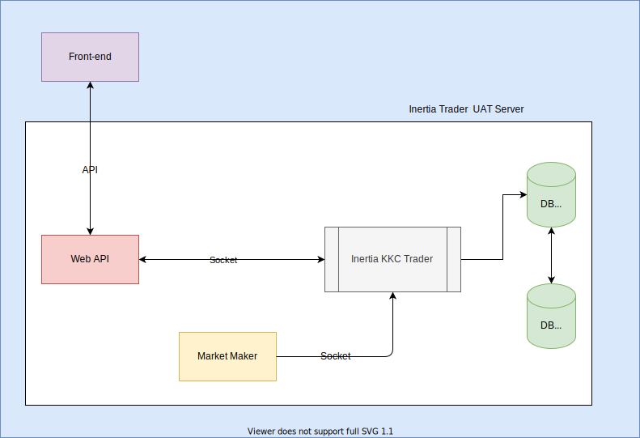

# InertiaTrader


[](https://travis-ci.org/joemccann/dillinger)

The project is mainly produce to simulate a stock/future trading system
  

## Features

- Simulate the financial product trading
- One by one matching method
- Immediate settlement contract
- Immediate account detail provide 
- Databases replication
- Add market maker to enhance the probablility of match up success  
&nbsp;

## Structure



&nbsp;

## Tech

Inertia Trader uses several manner to make sure the trading stability:

- C++11
- MariaDB 10.5.9
- node.js - evented I/O for the backend
- Express - fast node.js network app framework  
&nbsp;

## Installation

Install the dependencies and devDependencies and start the server.

```sh
cd InertiaTrader
make main
./trader.out devel
```
&nbsp;

## Plugins

Instructions on how to use them in your own application are linked below.

| Plugin | README |
| ------ | ------ |
| GitHub | [README](./UML.svg)|

&nbsp;

## Docker

InertiaTrader is very easy to install and deploy in a Docker container.

Dockerised InertiaTrader(port 1203)

```sh
docker build -t inertiatrader .
docker run -it inertiatrader ./trader.out devel -- --coverage
```

Dockerised Database(port 3306)

```sh
docker build -f dockerfile.db -t mydb .
docker run -d -p 3306:3306 --name mydb-container mydb
```

Dockerised trading environment deploy

```sh
docker-compose up -d
```

Shut down whole docker stack

```sh
docker-compose down
```

## RESTFUL API

`GET Login`

```sh
/connTrader?username={username}&password={password}
```

`GET Create account`

```sh
/addTrader?username={username}&password={password}
```

`GET Send Order`

```sh
/clicked?sideselect={side}&orderprice={orderprice}
```

## Contributors

[Contributors](./CONTRIBUTORS.md)

## License

[MIT](./LICENSE)
